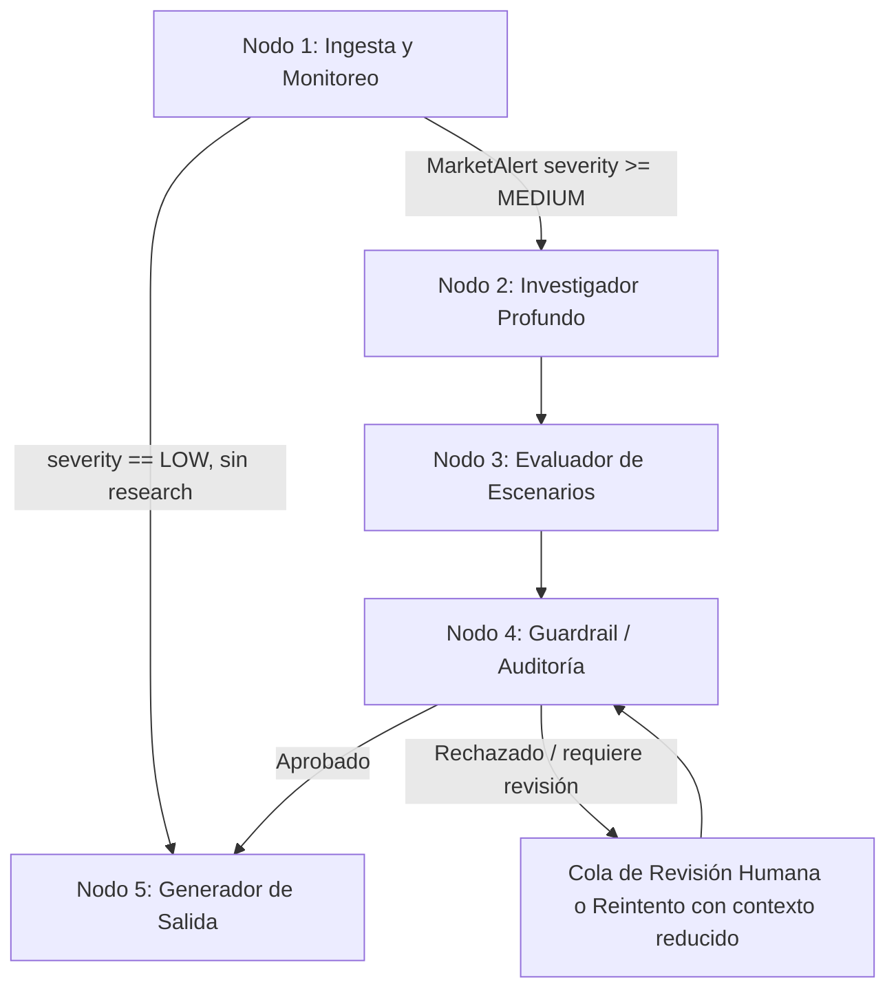

# Spec.md — Plataforma de Inversión Inteligente Multi-Asset (Acciones + Cripto)

**Versión:** 1.0
**Autor:** Lead Product Manager / Cuantitativo Financiero
**Estado:** Draft técnico para implementación
**Stack de referencia:** Python 3.11+, LangGraph, LangChain, Pydantic v2 (strict), Polygon.io / Financial Modeling Prep, Tavily / Exa.ai, Gemini 1.5 Pro/Flash, Telegram/Discord

---

## 1. Visión General del Sistema

### 1.1 Objetivo

Construir un **Copiloto Financiero Multi-Asset** que combina monitoreo de mercado en tiempo
real, investigación profunda automatizada y generación de alertas accionables, cubriendo
**Acciones** y **Criptomonedas** bajo una misma capa de razonamiento.

El sistema no es un "stock picker" ni un bot de trading automático: es un **sistema de
inteligencia y alerta** que:

1. Vigila continuamente los activos en la watchlist del usuario contra umbrales configurables
   (precio, volumen, volatilidad, eventos on-chain, catalizadores de noticias).
2. Cuando detecta una anomalía relevante, dispara una investigación profunda automatizada
   (RAG sobre noticias, filings regulatorios, transcripciones de earnings, métricas on-chain).
3. Evalúa la anomalía en múltiples horizontes temporales y produce una **Ficha de Inteligencia**
   con escenarios probabilísticos.
4. Audita su propia salida contra alucinaciones antes de notificar al usuario (Guardrail).
5. Entrega la conclusión en el formato adecuado al nivel de sofisticación del usuario.

**No-objetivos explícitos (fuera de alcance de esta spec):**
- Ejecución automática de órdenes de compra/venta (el sistema es informativo, no transaccional).
- Custodia de fondos o conexión a brokers/exchanges con permisos de trading.
- Garantía de rendimiento o asesoría financiera regulada (el sistema declara explícitamente
  que no sustituye asesoría profesional licenciada).

### 1.2 Perfiles de Usuario

El sistema sirve a un espectro de sofisticación financiera mediante un **modo de salida
adaptativo** controlado por el perfil del usuario, no por dos productos separados. El mismo
análisis subyacente se renderiza en dos "lentes":

| Perfil | Nombre interno | Descripción | Salida característica |
|---|---|---|---|
| Principiante / Intermedio | **"Traductor Financiero"** | Usuario que entiende conceptos básicos (precio, ganancia/pérdida) pero no jerga técnica (PEG, TVL, backwardation). Quiere saber "¿qué pasó y me debería importar?" | Alertas cortas en lenguaje natural, analogías cotidianas, sin jerga sin explicar, severidad expresada en semáforo (🟢🟡🔴). |
| Avanzado / Profesional | **"Ficha de Inteligencia Profunda"** | Usuario que opera con múltiplos, ratios on-chain, y quiere trazabilidad de la fuente de cada dato. Quiere "¿qué cambió en los fundamentales y cuál es la probabilidad de cada escenario?" | Reporte estructurado: métricas crudas, fuente y timestamp de cada dato, tabla de escenarios con probabilidades, enlaces a filings/transcripciones citadas. |

El perfil se almacena en `UserWatchlist.user_profile` (ver §2.1) y actúa como un flag de
formato en el **Nodo 5 (Generador de Salida)** — el razonamiento de los Nodos 1-4 es idéntico
para ambos perfiles; solo cambia la capa de presentación (principio de "un solo cerebro, dos
idiomas").

---

## 2. Arquitectura de Datos y Entidades (Modelos Pydantic v2)

Todos los modelos usan `ConfigDict(strict=True, extra="forbid")`. Los modelos que representan
un snapshot histórico inmutable (resultado ya calculado, alerta ya emitida) además usan
`frozen=True`. Todo campo que pueda estar ausente en el payload de origen se tipa `X | None`
y se acompaña de un campo de estado explícito (ver principio de "Cero Alucinación" en
`.cursorrules` §1) — nunca se usa `0`, `0.0` o `""` como sustituto silencioso de "sin dato".

### 2.1 `UserWatchlist`

Representa la configuración de vigilancia de un usuario: qué activos sigue y con qué umbrales.

```python
from datetime import datetime
from decimal import Decimal
from enum import Enum
from typing import Literal
from pydantic import BaseModel, ConfigDict, Field


class AssetClass(str, Enum):
    EQUITY = "EQUITY"
    CRYPTO = "CRYPTO"


class UserProfile(str, Enum):
    TRADUCTOR_FINANCIERO = "TRADUCTOR_FINANCIERO"       # principiante/intermedio
    FICHA_INTELIGENCIA_PROFUNDA = "FICHA_INTELIGENCIA_PROFUNDA"  # avanzado/profesional


class AlertThresholds(BaseModel):
    """Umbrales configurables por el usuario para disparar el Nodo 1."""

    model_config = ConfigDict(strict=True, extra="forbid")

    price_change_pct_intraday: Decimal | None = Field(
        default=None, description="Ej. 5.0 = alertar si el precio se mueve ±5% intradía."
    )
    volume_spike_multiple: Decimal | None = Field(
        default=None, description="Ej. 3.0 = alertar si el volumen es 3x el promedio de 20 días."
    )
    volatility_iv_rank_threshold: Decimal | None = None  # solo equities con opciones listadas
    on_chain_active_addresses_change_pct: Decimal | None = None  # solo cripto
    news_sentiment_shock: bool = False  # alertar ante titulares de alto impacto sin importar magnitud


class WatchedAsset(BaseModel):
    model_config = ConfigDict(strict=True, extra="forbid")

    ticker: str = Field(description="Símbolo normalizado, ej. 'AAPL' o 'BTC-USD'.")
    asset_class: AssetClass
    thresholds: AlertThresholds
    added_at: datetime
    notes: str | None = None


class UserWatchlist(BaseModel):
    model_config = ConfigDict(strict=True, extra="forbid")

    user_id: str
    user_profile: UserProfile
    assets: list[WatchedAsset] = Field(default_factory=list)
    horizon_focus: list[Literal["CORTO", "MEDIANO", "LARGO"]] = Field(
        default_factory=lambda: ["CORTO", "MEDIANO", "LARGO"],
        description="Horizontes que le interesan al usuario; filtra qué escenarios se notifican.",
    )
    notification_channels: list[Literal["TELEGRAM", "DISCORD"]] = Field(default_factory=list)
    updated_at: datetime
```

### 2.2 `FinancialMetrics` (Acciones)

Snapshot de fundamentales de una acción en un instante dado. Cada métrica es un objeto con
estado, no un valor pelado, para cumplir la regla de cero alucinación.

```python
class DataStatus(str, Enum):
    OK = "OK"
    NO_DISPONIBLE = "NO_DISPONIBLE"
    ERROR_API = "ERROR_API"
    STALE = "STALE"  # dato presente pero más viejo que el SLA de frescura definido


class MetricValue(BaseModel):
    """Envoltorio estándar para cualquier valor financiero individual."""

    model_config = ConfigDict(strict=True, extra="forbid", frozen=True)

    value: Decimal | None
    status: DataStatus
    source: str  # ej. "polygon.io/v3/reference/financials"
    as_of: datetime | None = None


class FinancialMetrics(BaseModel):
    """Fundamentales de una acción en un instante dado. Inmutable: es un snapshot."""

    model_config = ConfigDict(strict=True, extra="forbid", frozen=True)

    ticker: str
    fetched_at: datetime

    price_earnings_ratio: MetricValue          # P/E
    price_earnings_growth_ratio: MetricValue   # PEG
    debt_to_ebitda: MetricValue                # Deuda/EBITDA
    free_cash_flow: MetricValue                # FCF en moneda reportada
    free_cash_flow_yield_pct: MetricValue
    revenue_growth_yoy_pct: MetricValue
    gross_margin_pct: MetricValue
    operating_margin_pct: MetricValue
    return_on_equity_pct: MetricValue
    current_ratio: MetricValue
    shares_outstanding: MetricValue
    market_cap: MetricValue

    fundamentals_period: Literal["TTM", "FY", "Q"] = "TTM"
    fundamentals_report_date: datetime | None = Field(
        default=None, description="Fecha del reporte fuente (10-K/10-Q) que originó estos números."
    )
```

### 2.3 `CryptoOnChainMetrics`

Equivalente a `FinancialMetrics` pero para el dominio cripto, donde los "fundamentales" son
métricas on-chain en vez de contables.

```python
class CryptoOnChainMetrics(BaseModel):
    model_config = ConfigDict(strict=True, extra="forbid", frozen=True)

    asset_symbol: str  # ej. "ETH", "SOL"
    chain: str          # ej. "ethereum", "solana" — relevante para multi-chain assets
    fetched_at: datetime

    total_value_locked_usd: MetricValue          # TVL
    tvl_change_7d_pct: MetricValue
    staking_ratio_pct: MetricValue                 # % de supply en staking
    staking_apr_pct: MetricValue
    active_addresses_24h: MetricValue
    active_addresses_change_7d_pct: MetricValue
    transaction_count_24h: MetricValue
    exchange_netflow_24h: MetricValue              # negativo = saliendo de exchanges (bullish proxy)
    circulating_supply: MetricValue
    fully_diluted_valuation_usd: MetricValue
    realized_price_usd: MetricValue                # proxy de costo base agregado de holders

    data_provenance: Literal["ON_CHAIN_DIRECT", "AGGREGATOR_API"] = "AGGREGATOR_API"
```

### 2.4 `MarketAlert`

Salida del **Nodo 1** (y potencialmente enriquecida por Nodos posteriores). Representa un
evento disparador antes de la investigación profunda.

```python
class AlertSeverity(str, Enum):
    LOW = "LOW"
    MEDIUM = "MEDIUM"
    HIGH = "HIGH"
    CRITICAL = "CRITICAL"


class AlertTriggerType(str, Enum):
    PRICE_MOVE = "PRICE_MOVE"
    VOLUME_SPIKE = "VOLUME_SPIKE"
    NEWS_SHOCK = "NEWS_SHOCK"
    ON_CHAIN_ANOMALY = "ON_CHAIN_ANOMALY"
    VOLATILITY_SPIKE = "VOLATILITY_SPIKE"
    FUNDAMENTAL_CHANGE = "FUNDAMENTAL_CHANGE"  # ej. revisión de guidance, downgrade de rating


class MarketAlert(BaseModel):
    model_config = ConfigDict(strict=True, extra="forbid", frozen=True)

    alert_id: str
    ticker: str
    asset_class: AssetClass
    trigger_type: AlertTriggerType
    severity: AlertSeverity
    detected_at: datetime

    trigger_value: Decimal | None = Field(
        description="Magnitud que disparó la alerta, ej. -6.2 (%) para PRICE_MOVE."
    )
    threshold_breached: Decimal | None

    requires_deep_research: bool = Field(
        description="True si severity >= MEDIUM; determina si se invoca el Nodo 2."
    )
    raw_context_snapshot: dict[str, str] = Field(
        default_factory=dict,
        description="Pares clave-valor mínimos para trazabilidad (ej. {'volume': '...', 'avg_volume_20d': '...'}).",
    )
```

### 2.5 `AssetProjection`

Salida del **Nodo 3 (Evaluador de Escenarios)**. Modela probabilidades por horizonte, nunca
una predicción puntual determinista.

```python
class ScenarioOutcome(BaseModel):
    model_config = ConfigDict(strict=True, extra="forbid", frozen=True)

    label: Literal["ALCISTA", "NEUTRAL", "BAJISTA"]
    probability_pct: Decimal = Field(ge=0, le=100)
    rationale: str = Field(description="Justificación trazable a datos concretos, no genérica.")
    key_evidence_refs: list[str] = Field(
        default_factory=list,
        description="IDs o URLs de las fuentes citadas (filing, transcript, artículo, métrica on-chain).",
    )


class HorizonScenarios(BaseModel):
    model_config = ConfigDict(strict=True, extra="forbid", frozen=True)

    horizon: Literal["CORTO_1_14D", "MEDIANO_1_6M", "LARGO_1_3A"]
    scenarios: list[ScenarioOutcome] = Field(
        description="Debe cubrir ALCISTA/NEUTRAL/BAJISTA; las probabilidades deben sumar 100 (±0.5 tolerancia)."
    )
    confidence_level: Literal["BAJA", "MEDIA", "ALTA"] = Field(
        description="Confianza del modelo en esta distribución, dado el volumen y calidad de evidencia disponible."
    )
    data_completeness_pct: Decimal = Field(
        ge=0, le=100,
        description="% de las métricas requeridas para este horizonte que tenían status=OK.",
    )


class AssetProjection(BaseModel):
    model_config = ConfigDict(strict=True, extra="forbid", frozen=True)

    ticker: str
    generated_at: datetime
    source_alert_id: str

    horizons: list[HorizonScenarios] = Field(
        description="Uno por cada horizonte: CORTO_1_14D, MEDIANO_1_6M, LARGO_1_3A."
    )
    classification: Literal["REACCION_EMOCIONAL", "DETERIORO_FUNDAMENTAL", "INDETERMINADO"] = Field(
        description="Ver Metodología §4.1 para los criterios de clasificación."
    )
    classification_confidence_pct: Decimal = Field(ge=0, le=100)
```

---

## 3. Flujo de Procesamiento del Orquestador (LangGraph)

El grafo se modela como un `StateGraph` con un estado tipado compartido (`AgentState`,
`TypedDict`/Pydantic) que se enriquece progresivamente. Cada nodo es `async def`, recibe el
estado actual y devuelve un delta de estado. Un nodo que falla en su propia capa de ingesta
NUNCA tumba el grafo completo: degrada su propia salida a `status=ERROR_API` / `NO_DISPONIBLE`
y permite que el grafo continúe con incertidumbre explícita.



### 3.1 Nodo 1 — Ingesta & Monitoreo en Tiempo Real

**Responsabilidad:** polling/streaming de precios, volumen y métricas on-chain de los activos
en `UserWatchlist`, comparando contra `AlertThresholds`. Es el único nodo con cadencia
alta-frecuencia (segundos-minutos); los demás nodos se ejecutan bajo demanda.

**Entradas:** `UserWatchlist`, feeds en vivo de Polygon.io (equities), feed de mercado cripto
(on-chain + spot).

**Lógica:**
1. Para cada `WatchedAsset`, obtener el snapshot de mercado más reciente (async, en paralelo
   vía `asyncio.gather` por lote de tickers, respetando rate limits del proveedor).
2. Calcular deltas contra el baseline (precio de apertura, promedio móvil de volumen 20d,
   dirección de active addresses 7d, etc.).
3. Evaluar cada `AlertThresholds` configurado. Si se rompe uno o más umbrales, emitir un
   `MarketAlert` con `severity` calculada según la magnitud de la ruptura (ver tabla §4).
4. Marcar `requires_deep_research = True` cuando `severity >= MEDIUM`.
5. Si `severity == LOW`, el alert se enruta directamente al Nodo 5 como "nota informativa"
   sin pasar por investigación profunda (evita gastar presupuesto de LLM/API en ruido menor).

**Salida:** lista de `MarketAlert` para el ciclo actual.

**SLA de frescura:** ningún dato usado en la evaluación de umbrales puede tener más de
`N` minutos de antigüedad (configurable por asset class: ej. 1 min para equities líquidas
en horario de mercado, 5 min para cripto 24/7). Si el proveedor devuelve un dato más viejo,
se marca `DataStatus.STALE` y NO se usa para disparar una alerta de alta severidad.

### 3.2 Nodo 2 — Investigador Profundo (RAG / Síntesis)

**Responsabilidad:** dado un `MarketAlert` con `requires_deep_research = True`, construir
contexto cualitativo que explique el "por qué" detrás del movimiento cuantitativo.

**Fuentes:**
- **Noticias/web:** Tavily y Exa.ai, con queries generadas dinámicamente a partir del ticker
  y la ventana temporal de la alerta (ej. "AAPL guidance cut" acotado a últimas 48h).
- **Filings regulatorios (solo equities):** 10-K (anual) y 10-Q (trimestral) más recientes vía
  EDGAR/proveedor de filings; se extraen secciones relevantes (MD&A, Risk Factors, Liquidity).
- **Transcripciones de earnings calls:** se indexan por chunks semánticos (embeddings) y se
  recupera el pasaje más relevante al trigger de la alerta (ej. mención de guidance, márgenes).
- **Cripto:** en vez de filings, se prioriza documentación on-chain (governance forums,
  anuncios oficiales del protocolo, dashboards de TVL) y noticias de exchanges/regulación.

**Proceso RAG:**
1. Retrieval híbrido: búsqueda léxica (BM25) + semántica (embeddings) sobre el corpus indexado
   más búsqueda web fresca (Tavily/Exa) para eventos de las últimas horas no indexados aún.
2. Deduplicación y ranking por relevancia + recencia + credibilidad de fuente (whitelist de
   dominios: SEC.gov, comunicados oficiales del emisor/protocolo > medios tier-1 > blogs).
3. Síntesis vía Gemini 1.5 Pro (contexto largo, ideal para digerir 10-Ks completos) con un
   prompt que **exige citar la fuente de cada afirmación** y prohíbe explícitamente completar
   con conocimiento general no presente en el contexto recuperado (cumple `.cursorrules` §1).
4. Salida estructurada: resumen de hallazgos + lista de `key_evidence_refs` (URLs/IDs) que
   alimentan directamente `ScenarioOutcome.key_evidence_refs` en el Nodo 3.

**Salida:** `ResearchDossier` (contexto enriquecido, no expuesto directamente al usuario) que
se adjunta al estado del grafo para el Nodo 3.

### 3.3 Nodo 3 — Evaluador de Escenarios

**Responsabilidad:** transformar el `ResearchDossier` + `FinancialMetrics`/`CryptoOnChainMetrics`
en un `AssetProjection` con probabilidades explícitas por horizonte.

**Horizontes fijos:**
| Horizonte | Ventana | Enfoque analítico dominante |
|---|---|---|
| `CORTO_1_14D` | 1 a 14 días | Momentum técnico, flujo de noticias, catalizadores agendados (earnings, CPI, vencimiento de opciones, desbloqueos de tokens). |
| `MEDIANO_1_6M` | 1 a 6 meses | Tendencia de fundamentales trimestrales, guidance de la empresa, roadmap del protocolo, ciclo macro. |
| `LARGO_1_3A` | 1 a 3 años | Tesis estructural: foso competitivo, TAM, tokenomics de largo plazo, riesgo regulatorio estructural. |

**Lógica de cálculo de probabilidades:**
- Modelo de ensamble ligero, no una caja negra: se combina (a) señal cuantitativa (z-scores de
  métricas vs. su propia serie histórica y vs. peers del sector) con (b) señal cualitativa
  (score de sentimiento e impacto extraído del `ResearchDossier` por el LLM).
- El LLM (Gemini) recibe ambas señales ya calculadas (no calcula probabilidades "a ojo" desde
  texto crudo) y las combina en una distribución `ALCISTA/NEUTRAL/BAJISTA` por horizonte,
  con `rationale` obligatorio trazable a `key_evidence_refs`.
- `data_completeness_pct` se calcula determinísticamente en código (no por el LLM): proporción
  de métricas requeridas para ese horizonte que tenían `status=OK`. Si `data_completeness_pct`
  cae bajo un umbral (ej. 60%), `confidence_level` se fuerza a `BAJA` sin importar lo que
  "crea" el LLM.
- Las probabilidades de cada horizonte deben sumar 100% (±0.5 de tolerancia por redondeo);
  esto se valida en código (Pydantic `model_validator`), no se confía en que el LLM sume bien.

**Salida:** `AssetProjection` completo, incluyendo la clasificación preliminar
(`REACCION_EMOCIONAL` vs `DETERIORO_FUNDAMENTAL`, ver §4.1).

### 3.4 Nodo 4 — Guardrail / Auditoría de Alucinaciones

**Responsabilidad:** ser la última línea de defensa antes de que cualquier cifra o afirmación
llegue al usuario. Este nodo es el "segundo par de ojos" automatizado, independiente del
razonamiento que produjo el `AssetProjection`.

**Checks obligatorios (todos deben pasar; cualquier fallo bloquea la salida):**

1. **Verificación de cita (grounding check):** por cada `ScenarioOutcome.rationale`, verificar
   que cada cifra/afirmación mencionada exista literalmente en `key_evidence_refs` o en el
   `ResearchDossier` original. Se usa un segundo pase de LLM (o comparación determinística de
   entidades numéricas) en modo "verificador", separado del LLM "generador", para reducir
   correlación de errores.
2. **Consistencia numérica:** las probabilidades suman ~100%; ningún `MetricValue` con
   `status != OK` aparece citado como si fuera un dato confirmado.
3. **Chequeo de fuente prohibida:** ninguna afirmación proviene de una fuente fuera de la
   whitelist definida en el Nodo 2 (evita que el LLM "recuerde" de su entrenamiento en vez de
   citar el contexto recuperado).
4. **Chequeo de recencia:** si la alerta original es de `severity=CRITICAL`, todas las fuentes
   citadas deben tener `as_of`/fecha de publicación dentro de la ventana de la alerta (evita
   proyectar con noticias viejas irrelevantes al evento actual).
5. **Sanity check de magnitud:** si una proyección de corto plazo implica un movimiento de
   precio implícito extremo (ej. probabilidad ALCISTA > 90% con evidencia débil), se marca
   para revisión en vez de auto-aprobarse.

**Resultado:**
- **Aprobado:** el `AssetProjection` pasa intacto al Nodo 5.
- **Rechazado:** el estado se marca `guardrail_status=REJECTED` con el motivo específico;
  se reintenta el Nodo 3 con contexto acotado (solo evidencia verificada) hasta `MAX_RETRIES`
  (ej. 2). Si se agotan los reintentos, la alerta se degrada a formato "solo datos crudos, sin
  interpretación" y se loggea como incidente de calidad para revisión humana — nunca se
  entrega una interpretación no verificada al usuario.

### 3.5 Nodo 5 — Generador de Salida

**Responsabilidad:** renderizar el `AssetProjection` (ya auditado) en el formato adecuado al
canal y al perfil del usuario, y despachar la notificación.

**Lógica de formato (según `UserWatchlist.user_profile`):**
- **Traductor Financiero:** mensaje corto (≤ 400 caracteres para push), semáforo de severidad,
  1 frase de "qué pasó" + 1 frase de "qué significa" en lenguaje llano (ver reglas de
  traducción §4.2). Sin tablas, sin múltiplos financieros crudos.
- **Ficha de Inteligencia Profunda:** reporte extendido (dashboard o mensaje largo/embed) con:
  tabla de métricas crudas con fuente y timestamp, tabla de escenarios por horizonte con
  probabilidades y confidence level, enlaces a evidencia citada, clasificación
  emocional-vs-fundamental con su confianza.
- Ambos formatos comparten el mismo `AssetProjection` de origen — la diferencia es puramente
  de plantilla de presentación (`notification/message_templates.py`), nunca de contenido
  analítico subyacente.

**Canales:** Telegram Bot API (mensaje + botones inline opcionales "Ver ficha completa" que
despliegan más detalle) y Discord Webhooks (embed estructurado). El fallo de envío a un canal
se loggea y reintenta con backoff, pero nunca revierte ni recalcula el análisis ya producido.

---

## 4. Metodología Analítica y Fórmulas

### 4.1 Clasificación: "Reacción Emocional del Mercado" vs. "Deterioro Fundamental"

Esta es la clasificación central que el sistema debe producir con criterios **estandarizados
y auditables**, no un juicio subjetivo del LLM. Se calcula combinando una señal cuantitativa
(determinística, en código) con una señal cualitativa (del `ResearchDossier`), y el LLM solo
arbitra el caso cuando ambas señales no coinciden claramente.

**Paso 1 — Señal cuantitativa (Fundamental Deterioration Score, `FDS`):**

Se calcula comparando el trimestre/período más reciente contra la tendencia de los 4 períodos
previos, para las métricas disponibles (`status=OK`):

```
FDS = w1 * Δ(revenue_growth_yoy)
    + w2 * Δ(gross_margin_pct)
    + w3 * Δ(free_cash_flow_yield_pct)
    + w4 * Δ(debt_to_ebitda)          # invertido: aumento de apalancamiento resta
    + w5 * Δ(guidance_revision)        # -1 si guidance bajó, 0 si se mantuvo, +1 si subió

donde Δ(x) = (x_actual - promedio_móvil_4_periodos(x)) / desviación_estándar_4_periodos(x)
```
(z-score de la métrica más reciente contra su propia serie; pesos `w1..w5` configurables,
suman 1.0 por defecto, definidos en `core/config.py`, no hardcodeados en el nodo).

Para cripto, se sustituye por un `On-Chain Deterioration Score` análogo usando
`tvl_change_7d_pct`, `active_addresses_change_7d_pct`, `exchange_netflow_24h` (normalizado) y
`staking_ratio_pct` (una caída sostenida de staking ratio es señal de deterioro de convicción).

**Regla de completitud:** si menos del 60% de las métricas requeridas tienen `status=OK`,
`FDS` no se calcula (`None`) y la clasificación cae a `INDETERMINADO` — nunca se estima `FDS`
con datos parciales silenciados como si fueran completos.

**Paso 2 — Señal cualitativa (Market Reaction Magnitude, `MRM`):**

Del lado de mercado, se mide cuánto se movió el precio/métrica de trading vs. cuánto
"debería" haberse movido dado el `FDS`:

```
MRM = price_change_pct_observado / f(FDS)
```

donde `f(FDS)` es una función empírica calibrada por sector/asset class que traduce un `FDS`
dado a un movimiento de precio "esperado" históricamente (tabla de calibración mantenida y
versionada, no una constante mágica en el código).

**Paso 3 — Matriz de clasificación:**

| Condición | Clasificación | Confianza |
|---|---|---|
| `FDS` fuertemente negativo (< -1.5σ) **y** `MRM` ≈ 1 (movimiento de precio proporcional) | `DETERIORO_FUNDAMENTAL` | Alta si `data_completeness_pct` ≥ 80% |
| `FDS` neutral/leve (entre -0.5σ y +0.5σ) **y** `price_change_pct` grande (movimiento >> lo esperado) | `REACCION_EMOCIONAL` | Alta si el `ResearchDossier` no revela catalizador fundamental nuevo |
| `FDS` fuertemente negativo **y** `MRM` >> 1 (el mercado sobre-reaccionó incluso al deterioro real) | `DETERIORO_FUNDAMENTAL` con nota de "sobre-reacción adicional" | Media |
| `FDS` no calculable (< 60% completitud) o señales contradictorias | `INDETERMINADO` | Baja — se le comunica al usuario explícitamente que no hay evidencia suficiente |

**Rol del LLM en esta clasificación:** el LLM NO decide `FDS` ni `MRM` (son cálculos
determinísticos en código, testeables unitariamente). El LLM se usa exclusivamente para:
(a) verificar si el `ResearchDossier` contiene un catalizador fundamental genuinamente nuevo
que el `FDS` histórico (basado en el último reporte trimestral) todavía no captura —por
ejemplo, noticias de una demanda regulatoria posterior al cierre del trimestre— y (b) redactar
el `rationale` legible citando la evidencia. Esto evita que el LLM "alucine" una clasificación
basada en similaridad semántica de texto en vez de en la matemática de arriba.

### 4.2 Reglas para el Toggle "Explicar para Principiantes"

Cuando `user_profile = TRADUCTOR_FINANCIERO`, la capa de presentación aplica un
**diccionario de traducción determinístico** (no una reescritura libre del LLM sin
restricciones) para minimizar el riesgo de que la simplificación introduzca imprecisión.

**Reglas de traducción:**

1. **Prohibido mostrar un término técnico sin analogía adjunta.** Cada término del glosario
   técnico (`PEG`, `Deuda/EBITDA`, `TVL`, `Staking APR`, `IV Rank`, etc.) tiene una entrada
   fija en `notification/glossary_translations.py` con:
   - Analogía cotidiana pre-aprobada (revisada editorialmente, no generada on-the-fly).
   - Rango de interpretación ("alto"/"normal"/"bajo") calibrado por sector para ese término.
   - Ejemplo: `Deuda/EBITDA = 6x` → *"Esta empresa debe el equivalente a 6 años de sus
     ganancias operativas actuales — como una hipoteca muy alta respecto al sueldo."*
2. **La magnitud manda, no el término.** El mensaje al Traductor Financiero lidera con la
   consecuencia ("la empresa está gastando más de lo que gana"), no con la etiqueta técnica;
   el término técnico puede omitirse por completo si no aporta a la decisión del usuario.
3. **Severidad expresada como semáforo, nunca como número crudo de probabilidad.** En vez de
   "62% de probabilidad bajista a 6 meses", se traduce a una escala fija de 3-5 niveles
   (ej. 🟢 Sin acción necesaria / 🟡 Vale la pena revisar / 🔴 Cambio importante detectado),
   mapeada determinísticamente desde `ScenarioOutcome.probability_pct` y `severity` — el
   mapeo de rangos numéricos a niveles vive en configuración versionada, no en el prompt.
4. **La clasificación emocional-vs-fundamental se traduce a lenguaje de "ruido vs. señal":**
   - `REACCION_EMOCIONAL` → *"Esto parece más nerviosismo del mercado que un problema real de
     la empresa/proyecto."*
   - `DETERIORO_FUNDAMENTAL` → *"Esto refleja un cambio real en cómo le está yendo a la
     empresa/proyecto, no solo humor del mercado."*
   - `INDETERMINADO` → *"Todavía no hay suficiente información confiable para saber si esto es
     ruido o algo serio — lo seguimos monitoreando."* (Nunca se fuerza una conclusión cuando
     `INDETERMINADO`, ni siquiera para simplificar al usuario principiante.)
5. **Toda cifra que se muestre, incluso simplificada, mantiene trazabilidad interna** al
   `MetricValue`/`ScenarioOutcome` de origen (aunque no se muestre al usuario), de modo que un
   usuario que toque "Ver ficha completa" pueda escalar de la vista Traductor a la vista
   Ficha de Inteligencia Profunda sin recalcular nada — es un cambio de plantilla, no de datos.
6. **Prohibido usar la simplificación para ocultar incertidumbre.** Si
   `confidence_level = BAJA` o `data_completeness_pct` es bajo, el mensaje simplificado debe
   comunicar esa duda explícitamente (ej. "Con la información disponible hasta ahora...") en
   vez de presentar una conclusión con falsa seguridad.

---

## 5. Consideraciones Transversales de Cumplimiento

- **Disclaimer obligatorio:** todo output del Nodo 5, en ambos perfiles, incluye una nota de
  que el contenido es informativo y no constituye asesoría financiera regulada.
- **Auditoría end-to-end:** cada `AssetProjection` entregado al usuario debe ser reconstruible
  a partir de logs persistentes: `MarketAlert` origen → `ResearchDossier` usado → resultado del
  Nodo 4 (aprobado/rechazado y por qué) → mensaje final enviado. Esto es requisito de
  trazabilidad, no solo de debugging.
- **Versionado de metodología:** los pesos (`w1..w5`), tablas de calibración `f(FDS)`, y el
  glosario de traducción para principiantes son artefactos versionados independientemente del
  código de los nodos, de modo que un cambio metodológico quede documentado y sea auditable
  por separado de un cambio de implementación.
